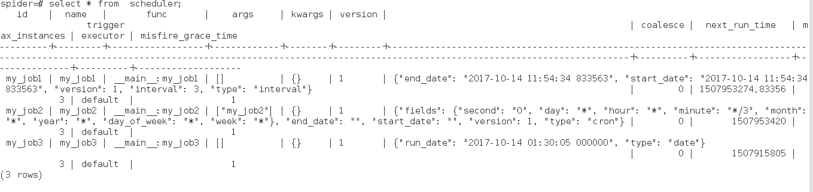

### apscheduler-dbjobstore
基于apscheduler，将排期存入数据库中，与自带的sqlalchemyjobstore的不同是抛弃了 pickle 格式

#### 使用说明

```
apscheduler-dbjobstore 是基于 apscheduler 进行的扩展，实现的功能是将 排期数据以人眼可视的数据格式存入数据库，抛弃了 pickle 

python 版本: python3.5 
apscheduler 安装： pip install apscheduler 

使用示例见 test.py 

效果见 
```
